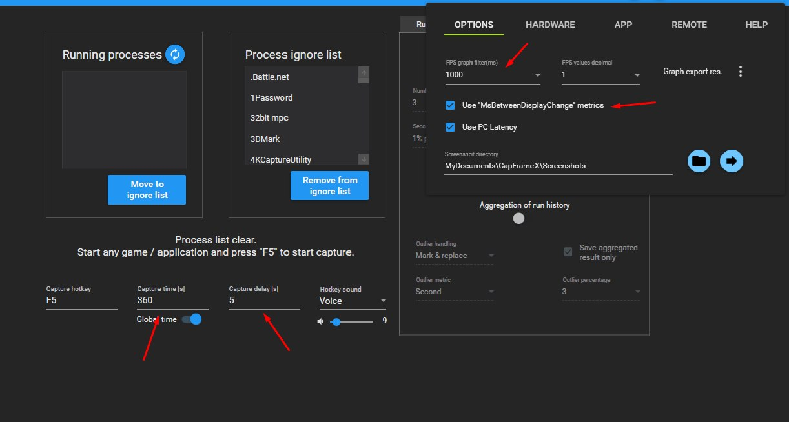

# Community benchmarks

This document describes how to capture a standardised STALCRAFT performance recording and attach it to [Discussions](../../discussions) so the JVM tuning profile can be validated on hardware we don't own.

## What is collected

A CapFrameX capture contains the CPU / GPU / motherboard model, RAM size and speed, drivers, OS build, PresentMon version, frametime sample array (frametime.ms) and aggregate metrics (avg, p99, etc.). Nothing else — the data is public and safe to attach to a Discussion.

## Protocol

Conditions are identical across submissions — otherwise captures can't be compared.

### 1. System prep

- Close **Discord, Telegram, Steam overlay, OBS, the browser** and any background program that might compete for CPU/RAM.
- Turn off Windows notifications for the duration of the test.
- Plug laptops into AC.

### 2. CapFrameX settings

The settings live in two places. `Capture time` and `Capture delay` are on the main screen; the rest is under the gear icon in the top-right corner → **OPTIONS** tab.

- **Capture time**: `360` seconds.
- **Capture delay**: `5` seconds.
- **FPS graph filter (ms)**: `1000`.
- **Use "MsBetweenDisplayChange" metrics**: enabled (checkbox). Makes CapFrameX measure frametime at the moment a frame hits the display rather than at raw present time — the numbers then reflect what the player actually sees.

### 3. Test scenario

1. Launch STALCRAFT.
2. Reach the character-select menu.
3. **First login** into the game on a fresh session — freshly initialised JIT, warm but not saturated caches.
4. Optionally disable non-essential HUD (compass, chats, kill feed).
5. Join a session on the **Морятник** map.
6. Start the CapFrameX recording.
7. Play normally for the full 360 seconds — combat, movement, interactions.

### 4. Number of runs

Ideally — **3 runs**. Rare events (zone transitions, shader compilation) are Poisson-distributed, so max frametime and large-stutter counts vary a lot between runs of the same config. Three recordings average out that variance.

Minimum — **1 run**. One is better than nothing.

## What to attach to the Discussion

Open [Discussions → Benchmark Submission](../../discussions/new?category=benchmarks) and fill in:

- **Config content** — the JSON from `jvm_wrapper/configs/<name>.json`, paste it into the "Config" field.
- **Links to CapFrameX JSON recordings** — upload to GitHub (drag-and-drop into the Discussion), Google Drive, or any file host with a direct link. Hardware specs (CPU, GPU, RAM MT/s, OS, drivers) are already embedded in the capture — no need to retype them.
- **A short subjective note** — "smooth", "occasional hitches", "crowd-fight stutter on Морятник". Numbers matter, perception matters too — especially if the three runs had noticeably different player counts on screen (say 2 people on average vs 5–6).

## Why this helps

JVM tuning is more hardware-dependent than it looks. Our own measurements only cover two specific rigs:

- **9900X3D + DDR5-6000 + RTX 5080** — fast-tier X3D
- **i5-10400F + DDR4-2666 + RTX 4060 Ti** — slow-tier non-X3D

Between those two sits a huge range: DDR4-3200 / 3600, Zen 3/4 without V-Cache, older i7 / i9 parts with varied memory, laptops with LPDDR5. Community data lets us:

- Validate the **mid tier** profile, which nobody has benchmarked yet.
- Catch regressions on uncommon configurations.
- Spot unexpected patterns (e.g. DDR4 CL14 vs CL19 at the same 3200 MT/s).

Thanks for contributing. Every recording makes the utility better for everyone.
